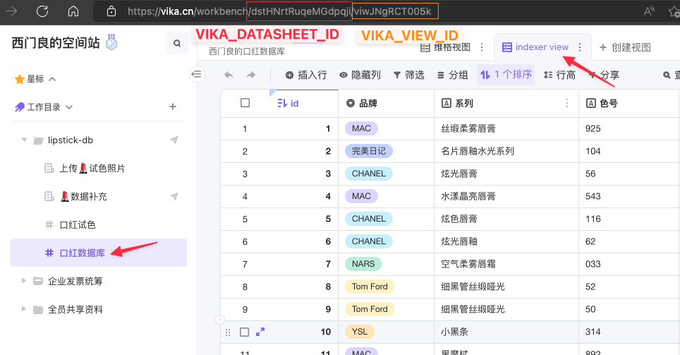
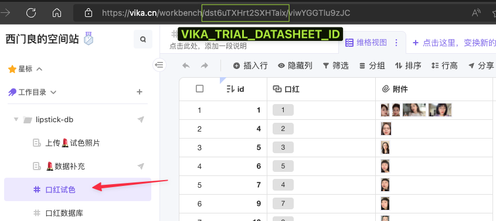
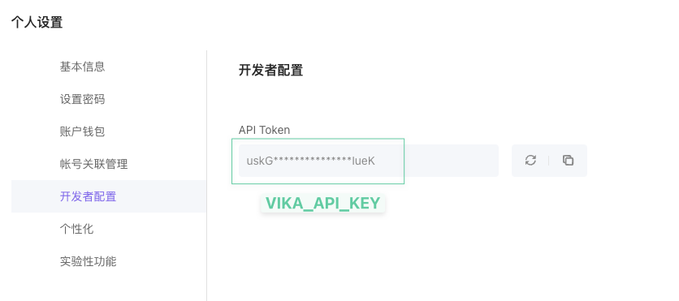

# 口红搜索引擎 Lipstick DB

用AI搜索口红！Find the right lipstick using AI!

[English Documentation](./README_en.md)

[Bilibili](https://www.bilibili.com/video/BV1tT41137UT)

[点击这里试一试](https://lipstick-db.senses.chat/)

# 本地开发步骤

## 系统依赖

系统需要安装Docker桌面版，我们需要通过docker运行minio才能正常在本地工作，如果没有Docker的话，需要到AWS上申请S3或者到腾讯云申请COS服务。

Python最低版本3.8+, 推荐3.9+（建议使用pyenv管理Python环境）

前端项目需要安装NodeJS v14+（推荐v16 LTS）和yarn v1，推荐使用nvm管理NodeJS环境

另外推荐安装make，因为项目使用了make配置环境变量注入

## docker依赖

运行以下命令启动minio服务：

```
docker compose up -d minio-service
```

本地启动之后，进入http://localhost:9001，输入用户名minio，密码minio123进入之后，到`Buckets` -> ` Create Bucket`，创建一个名为`lipstick-db`的资源桶。

## 项目依赖

首先安装项目依赖：

```shell
# python依赖
pip install pipenv
pipenv install
# 进入pipenv环境
pipenv shell
# nodejs依赖
cd ui
yarn
```

## 环境变量配置

项目有一个`.env.example`文件，复制这个文件，并重命名为`.env`，后续的步骤中，你将会在这个文件中配置项目所需的环境变量。

## 数据获取

项目所用到的口红和试色图片数据整理在[维格表](vika.cn)，请注册维格表账号，并把[口红数据库](https://vika.cn/share/shrJ5LfM3jqHj0ooaoCbL)另存为副本。

获得数据副本之后，请按照以下图示，记录以下几个字段，填入`.env`：







使用以下命令导入数据：

```shell
make full-import

# MacOS需要使用以下命令
JINA_MP_START_METHOD=forkserver make full-import
```

## 启动Jina Flow

命令行回到项目根目录之后：

```shell
make jina-local

# MacOS 请使用
JINA_MP_START_METHOD=forkserver make jina-local
```

Jina Flow服务器会在8888端口启动

## 启动FastAPI Server

命令行回到项目根目录之后：

```shell
# 正常启动
make main-app

# 开发过程中可以使用reload模式启动
make main-app args="--host 0.0.0.0 --reload"

# MacOS需要添加以下命令：
JINA_MP_START_METHOD=forkserver make main-app args="--host 0.0.0.0 --reload"
```

FastAPI服务器会在8000端口启动

## 启动UI

```shell
cd ui
yarn dev
```

UI会在端口3000启动

# 部署流程

## 构建docker镜像

```shell
make build-jina-docker #请确保数据已经在本地正确导入之后再运行
make build-fastapi-docker
```

构建之后可以直接通过提供的docker-compose部署：

```shell
docker-compose up -d
```

推荐部署到4核8G的服务器上。

UI部署请参考官方NextJS的部署方法，目前国内推荐使用[腾讯云SCF部署](https://cloud.tencent.com/document/product/1229/59270)，海外推荐使用[Vercel](https://vercel.com/guides/deploying-nextjs-with-vercel)。

## k8s部署

请参考`k8s`目录下的文件部署。目前k8s部署仅作为参考用，由于项目使用annlite存储数据，在搜索请求时容易导致OOM出错，请自行选择[外部存储方案](https://docarray.jina.ai/advanced/document-store/benchmark/)，对应调整之后再部署。

# 开源证书 License

[Apache License v2](./LICENSE)
